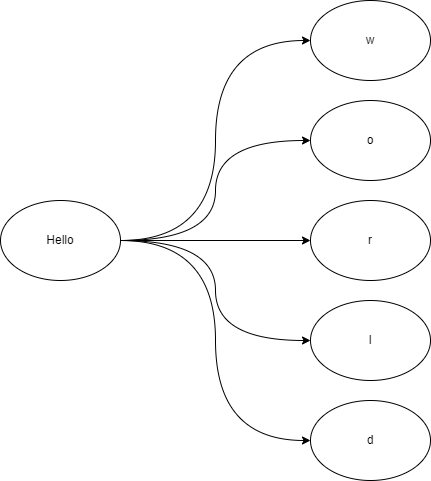

# go-healthz-sample
- healtch check impl
    - with cache
    - with up down log

# Library
## health check 
- https://github.com/alexliesenfeld/health
## sample client/server
- https://github.com/go-resty/resty
- https://github.com/gin-gonic/gin

# Image
- 